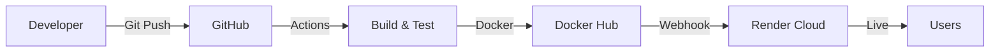

# DevOps Project - CI/CD Demo App

**Student:** Mann Dhaila | **Subject:** DevOps | **Semester:** 1

A professional Node.js web application that demonstrates a complete **DevOps pipeline** — from code push to automatic deployment, following the strict project guidelines.

---

## 🏛️ System Architecture

The project follows a standard CI/CD architectural flow. Below is the visualization of the pipeline:



> Detailed architecture description can be found in [docs/architecture.md](./docs/architecture.md).

---

## ✅ DevOps Concepts Implemented

| Interactive UI | Real-time Preview | ✅ Done |
| PDF Export | Browser Print (PDF) | ✅ Done |
| Source Code Management (SCM) | GitHub | ✅ Done |
| Branching Strategy | Feature Branches + PR | ✅ Done |
| CI/CD Pipeline | GitHub Actions | ✅ Done |
| Automated Testing | Jest (unit tests) | ✅ Done |
| Containerization | Docker | ✅ Done |
| Deployment | Render (cloud hosting) | ✅ Done |
| Secrets Management | GitHub Secrets | ✅ Done |

---

## 🔄 CI/CD Pipeline Flow

1. **SCM**: Code is pushed to a feature branch.
2. **PR**: A Pull Request is opened to merge into `main`.
3. **Build & Test**: GitHub Actions automatically runs `npm install` and `npm test`.
4. **Dockerization**: If tests pass, a Docker image is built and pushed to Docker Hub.
5. **Deployment**: Render detects the new image and deploys it automatically.

---

## 📸 Screenshots

### 1. Automated Testing Success

*Screenshot showing all Jest tests passing in the CI pipeline.*

### 2. CI/CD Pipeline Complete

*Screenshot showing all stages (Build, Docker, Deploy) marked green.*

### 3. Live Application on Render

*Screenshot of the application running successfully on the Render cloud platform.*

---

## 🧠 Challenges Faced

During the implementation of this DevOps pipeline, several challenges were encountered and resolved:

1. **GitHub Secrets Configuration**: Initially, the workflow failed because the `RENDER_DEPLOY_HOOK` was not set. This was resolved by implementing a conditional check in the YAML file to ensure the script only runs when the secret is available.
2. **Dockerization Pathing**: Moving the application code into the `app/` folder required updating the `Dockerfile` and `package.json` to ensure the container could still locate the entry point.
3. **CI/CD Optimization**: Updating from deprecated GitHub Actions (v3 to v4/v6) to ensure the pipeline remains stable and uses the latest security patches.
4. **Environment Consistency**: Ensuring the application runs identically in the local development environment, the GitHub Actions runner, and the production Docker container.

---

## 📁 Project Structure

Following the required project organization:

```
resume-builder-devops/
├── app/                    # Application source code
│   ├── public/             # Frontend assets
│   └── server.js           # Express server
├── .github/                # CI/CD workflow definitions
├── scripts/                # Automation & deployment scripts
│   └── deploy.sh
├── docs/                   # Documentation & diagrams
│   └── architecture.md
├── test/                   # Automated test cases
├── Dockerfile              # Container configuration
├── package.json            # Dependencies & scripts
└── README.md               # Main project documentation
```

---

## 🚀 Live Deployment
👉 **[View Live App on Render](https://resume-builder-devops.onrender.com)**

---

## 🛠️ Tech Stack
- **Runtime:** Node.js 18
- **Framework:** Express.js
- **Testing:** Jest + Supertest
- **CI/CD:** GitHub Actions
- **Container:** Docker
- **Deployment:** Render
- **SCM:** Git + GitHub