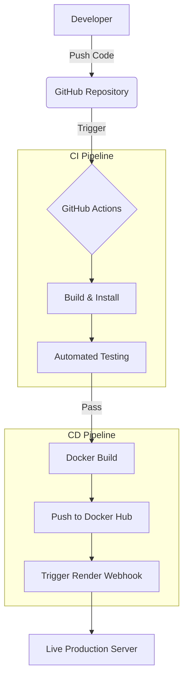

# System Architecture

The following diagram illustrates the complete DevOps CI/CD pipeline for this project.

### Components:
- **SCM**: GitHub for version control and collaboration.
- **CI**: GitHub Actions runs tests on every push/PR.
- **Containerization**: Docker ensures the app runs the same everywhere.
- **CD**: Automatic deployment to Render using webhooks.
